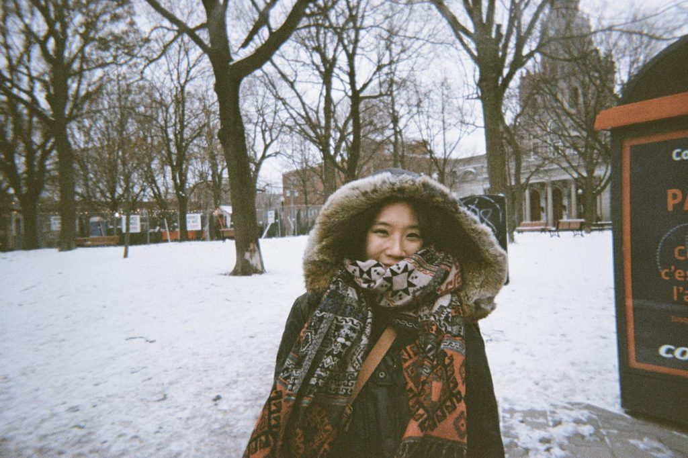

蒙特婁，蒙特利爾，還有個名字叫滿地可，位在加拿大東岸的魁北克法語區，鄰近與美國的交界處。

週五晚上11點，我從美國的Vermont([為什麼要去美國學法文](https://jessiesfreckles.com/2019/11/21/learning-french/))坐三個小時的公車，通過海關，抵達蒙特婁市中心的巴士站。拖著24寸行李箱往背包客棧走，經過正在party的公園，深黃色的燈泡掛在戶外、音樂從公園傳來，迎來一兩群行人。三四個人經過我，說著滿口法文，正當我還在試著理解他們在說什麼時，右邊經過的人興奮地用英文討論要去哪間酒吧。我停在人行道上，望向公園，富有歐洲氣息的戶外派對，兩種語言和諧卻衝突的停留在同一空間中，這是我與蒙特婁的第一次見面，好特別、好喜歡。

_「我想要駐足」離開香港後，本想再背起背包，旅行個一兩年。但為了遠行而遠行？再次一個人無腦衝是為了什麼？以前是為了探索？現在還有這個目的嗎？為了回答自己這些問題，留在台灣好一陣子，卻無法前進，即使旅居了泰國跟前往尼泊爾，但都訂好回程機票，確認自己的歸途，而這些經驗也都不足以回答這些心中的疑問。_

_想要久待一個地方，能夠看見未來把這個地方當成另一個家的地方。不是香港，台灣，永遠都是家，待是狡兔想要有三窟。_

_「你知道，兩三年，不算久待吧？」朋友好笑的諷刺。_

雖然說在蒙特婁大部分的人都會說英文，但是主要的語言還是以法語為主，所以路上看到的告示牌、餐廳、菜單、地鐵的廣播、路名幾乎都還是法文。有趣的是，因為蒙特婁太多說英文的人，所以走進餐廳或咖啡廳，店員通常會依照你的回覆決定要對你說英文或法文，所以在蒙特婁會很常聽到「Bonjour, Hi」。雖然我本身不是很喜歡這樣的問話方式，因為這句話翻譯其實就是「英文？還是法文？」跟打招呼沒什麼關係。

下榻的背包客棧，是在市區舊城區跟鄰近港口，也是在蒙特婁主要觀光區的中心。滿是正方形突出石階的歐式街道，建築也盡是法國或是英國殖民留下的痕跡。一週內就在附近把觀光景點逛完了，曾經在冬天造訪蒙特婁的比利時人告訴我，這一大片的湖面，冬天都會結成厚厚的冰，可以在上面滑冰歐。我訝異的看像湖面，感到不可思議。

_「要去哪？」是浮現腦中的第一個問題，趁著還能使用打工度假簽證，利用打工度假簽轉工作簽或永久居留簽的機會，思考各個國家的可能性。曾在法國短居三個月，很喜歡法國，可是法國治安差、失業率高，能夠一直住著又不感到厭煩的機率很低。歐洲主要說英語的英國跟愛爾蘭又沒什興趣。_

_很想回澳洲([The reason | 來到這裡的原因](https://jessiesfreckles.com/2018/09/09/the-reason-%e4%be%86%e5%88%b0%e9%80%99%e8%a3%a1%e7%9a%84%e5%8e%9f%e5%9b%a0/))，但是澳洲的工作投了都沒下文，打工度假簽也用畢。加拿大？好像是個很善待移民的地方，英文腔調也沒有澳洲難懂。去溫哥華看看好了，周遭這麼多可以露營的地方，應該會喜歡吧！_

在離市區一段距離的Le plateau，法文指的是「那一大片平的」，是我後來短住兩個月([加拿大蒙特婁｜15個人住在一個混亂與樂趣](https://jessiesfreckles.com/2020/02/07/montreal-house/))，找到工作後也沒有搬離的地區。夏天的時候，週日會有一整條街封街，街上滿滿的市集攤販，餐廳都有戶外座位，到處都看得到大家在吃早午餐、喝咖啡。Le plateau充斥著法國移民，充滿咖啡廳、藝廊、酒吧、麵包店、街頭塗鴉到處都是。放眼望去，說這裡是小歐洲一點也不為過。騎腳踏車就能探索的蒙特婁，友善的單車步道，到處都是的共享單車，夏天時到處都可以野餐的公園，還有座落市中心的山Mont royal，蒙特婁四周也散佈著國家公園跟露營區可去。

冬天，可以說是殘酷，零下-20度不算意外，又冷又長達五個月的冬天，日照時間也會在12月縮短許多，四點多天就開始黑了。但第一個在蒙特婁的冬天，他待我還不薄，沒有經歷過太長-30度的天氣，足以讓來自台灣的我，即使常常冬眠、不自覺睡覺時間變長，體驗雪上活動、冰上運動卻足以壓過那些缺點，讓我仍因下雪而讚嘆大自然的美麗，感動不已。

最後留在蒙特婁，可以說是在學習法語途中的意外([美國的法文語言學校到底怎麼讓我快速進步](https://jessiesfreckles.com/2020/01/02/%e6%b3%95%e6%96%87%e8%aa%9e%e8%a8%80%e5%ad%b8%e6%a0%a1/))。為什麼是這裡？似乎世界上很多角落都可以滿足我所說的理由，喜歡法文、安全、英文通、美麗、歷史氣息、沒有人在意你應該要怎麼穿著、怎麼說話.....。你知道，我就是對她一見鍾情，有時候愛上一個城市，你也不知所以。

初抵蒙特婁，我就意識到，是我第一次，想在一個地方駐足，想要在未來也能輕易說「回家」的地方。

